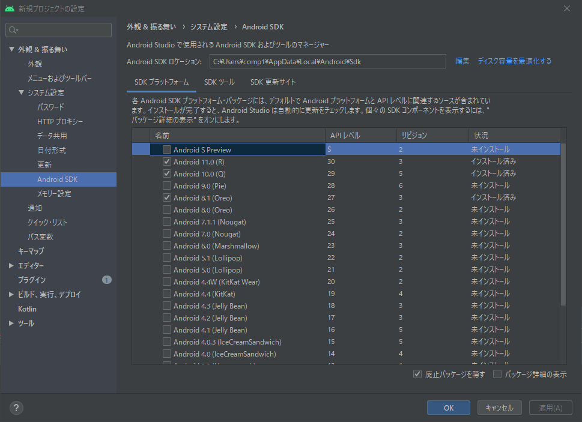
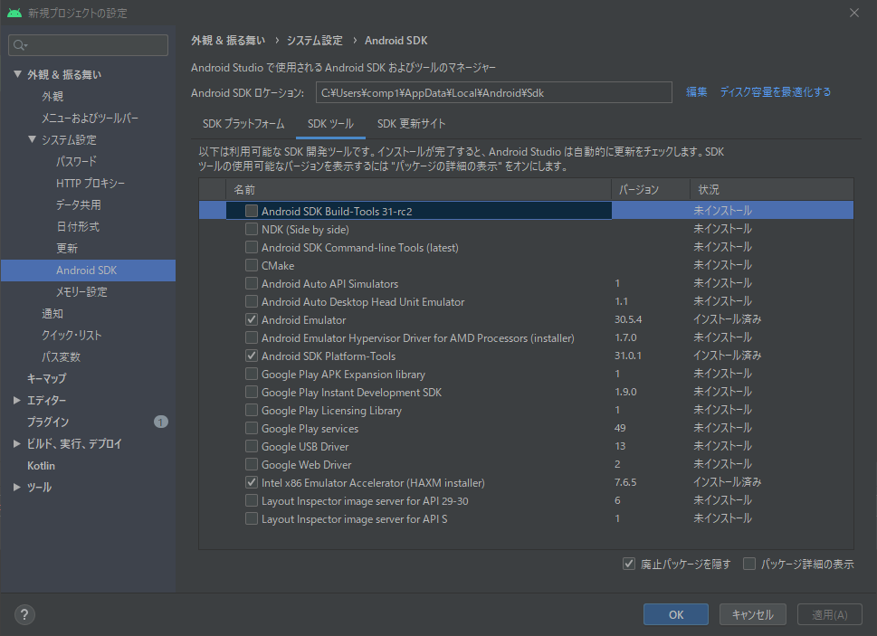
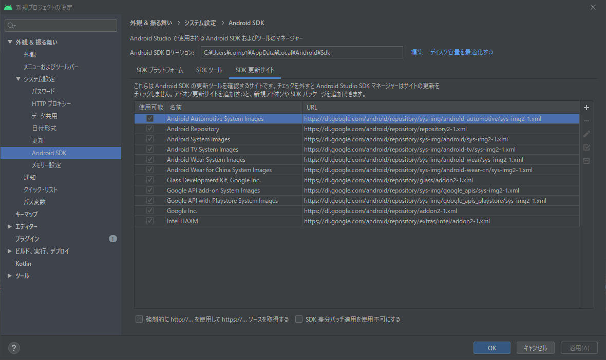
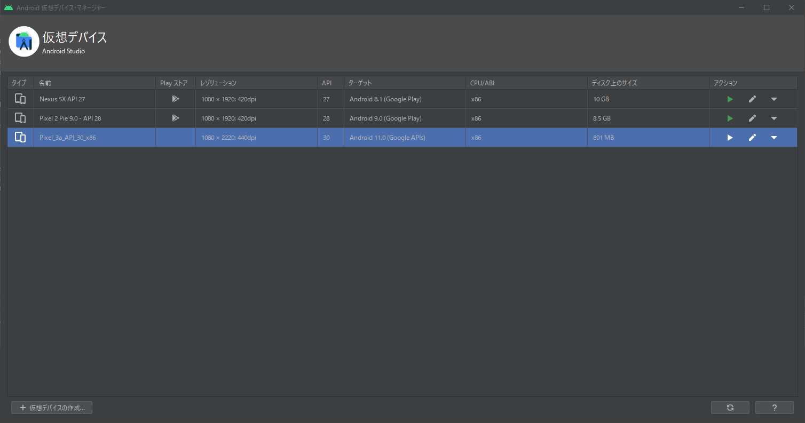
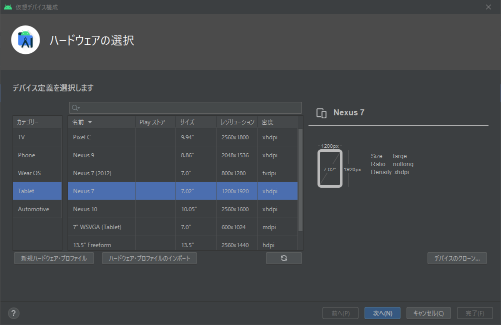
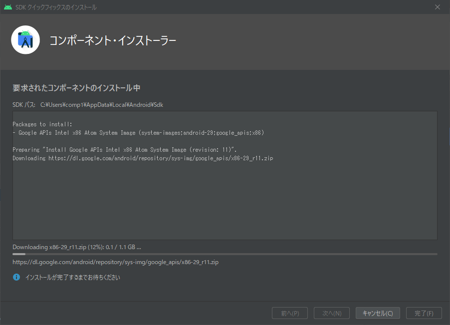
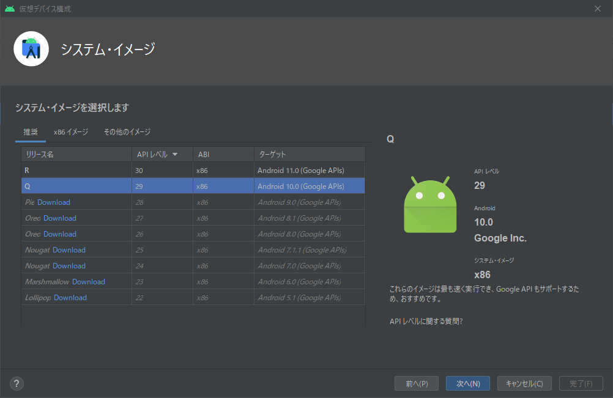
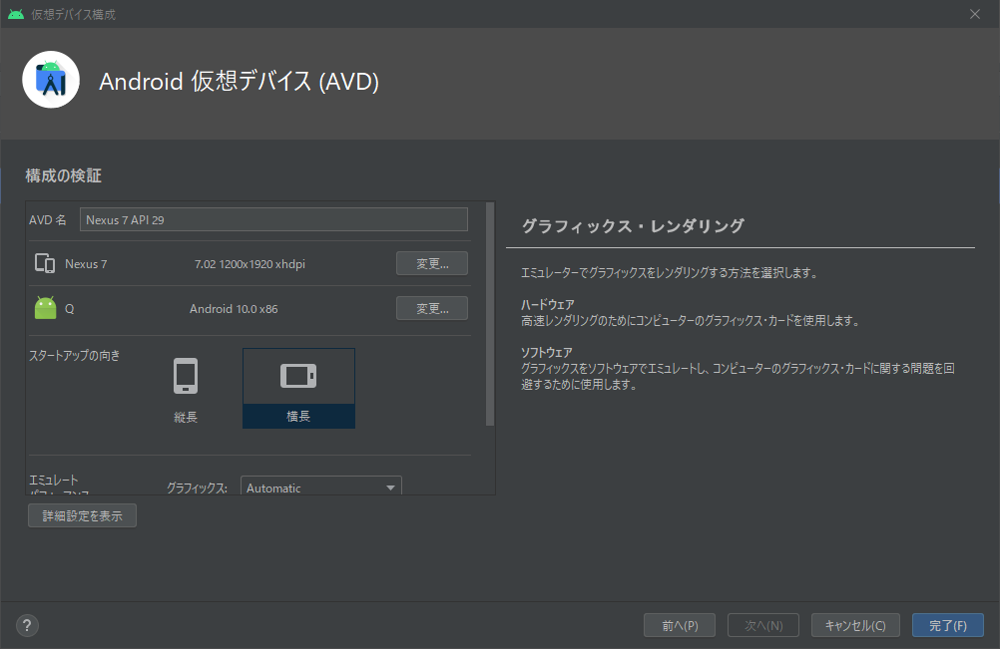
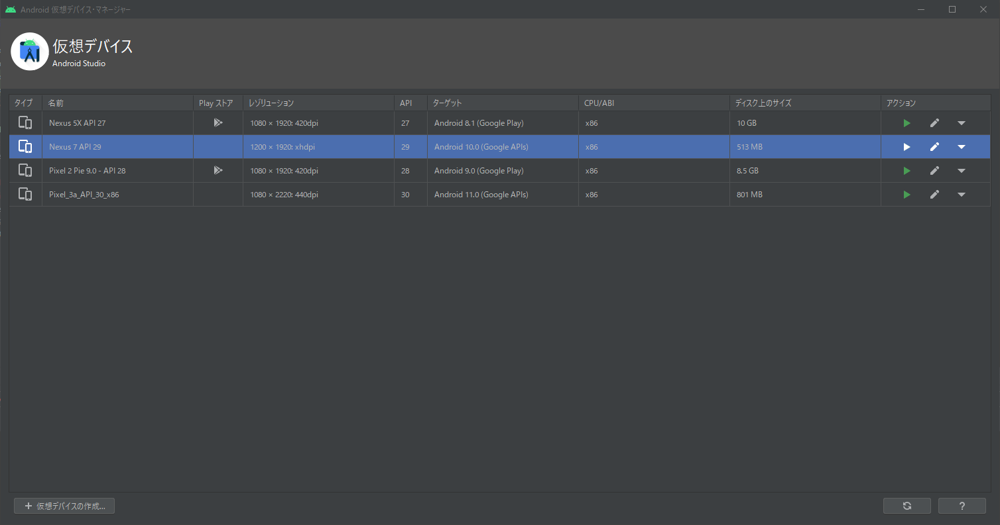
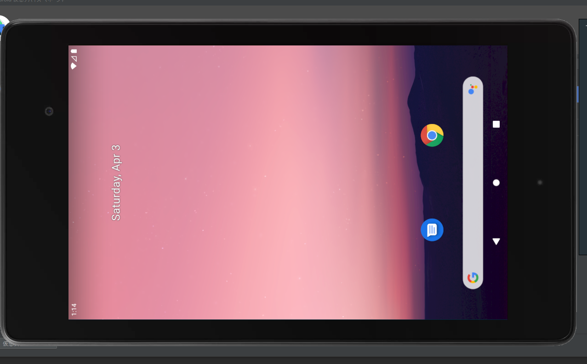

# Android studioの設定について
## SDKマネージャー
### SDKプラットフォーム

### SDKツール

### SDK更新サイト

# エミュレータについて
## AVDマネージャー
### 仮想デバイス

### ハードウェアの選択

### コンポーネント・インストーラー

### システム・イメージ

### Android仮想デバイス(AVD)

### 仮想デバイス

### エミュレーター

変更テスト