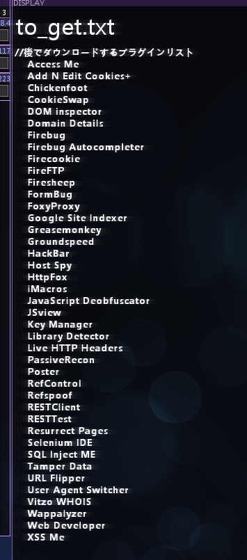

# rabbit_PC@252.74.106.222
- myPC
# Beagle_Internel@92.51.8.4
- 謎のPC

# Viper-Battlestation@86.151.3.117
- 入団試験用？proxy  
199.59.149.230
- binの中に「SSHcrack」があった

# Entropy_Asset_Cache@73.23.251.100
- Viperのところからつながっている
- binの中に「Hexなんとか」があった

# Entropy_test_server@199.59.149.230
- Viperのところに情報のあったEntropyのテストサーバー
- Bitからもここにアクセスしろと言われる

# Entropy関連
## Slash-Bot_News_Network@194.234.32.179
- Entropyの入団試験のために攻撃するサーバー
- システムダウンさせるといいらしい
    - Tom Wilkins が Entropyに対して避難的な記事を書いている

## Entropy_Asset_Server@42.63.220.55
- User=admin Pass=rosebud
- ポートが4つあって、まだ開けれない
- HTTP、SMTP、FTP、SSH

## Entropy_Contract_Database@63.27.141.50
- Entropyの案件データベース・サーバー
- User=rabbit Pass=rosebud
- ポートが4つあって、まだ開けれない
- HTTP、SMTP、FTP、SSH
- あと、ProxyとFireWallもある

## Starchip_Software@106.18.21.199
- Entropyの依頼
- 同僚の最新のファイルを削除する
- -Facespace Consortium
- アーカイブ.zipを削除して終了。バックアップ取り忘れたorz

## Celestia_Inc@100.165.232.209
- Entropyの依頼
- アーカイブを削除したら終わり
- -Enabled_Consortium

## X-C_Project_Tablet001RESEARCH@245.245.181.24
- Entropyの依頼
- 同僚のタブレット調査
- -C.O_Bradford
- 怪しいファイルのIDをメールに添付して報告
    - 2133、1938、1299、1300、4991

## Jasons_PowerBook_Plus@90.98.139.58
- Entropyからの直接の依頼
- eOSデバイスのハッキングのためのPC
- eOSデバイスのUser=admin Pass=alpine
- Account=jjstacks@jmail.com_Pass=tintin7

## PP_Marketing_Inc@10.233.160.105
- Entropyの依頼
- 盗まれたメーリングリストの削除(圧縮、暗号化されている可能性がある)

## Proxy_Node-X04@173.194.35.163
- Entropyからの直接の依頼
- Naixのサーバー

## Naix_Root_Gateway@173.194.35.172
- 目ざとい者なし
- rabbitのx-server.sysがあったｗ

## Naixのサーバー？@173.188.235.2

## Proxy_Node-22？@96.180.124.135
- Naixのプロクシ？
- 後でx-server.sysを削除する

## 203.194.22.112
- Naix？

## Nortron_Security_Web_Server@42.254.7.205
- Naixの依頼
- タイトルをDICKSにする

## Nortron_Internal_Services_Server@233.189.176.62
- Nortronにつながってた
- Mail_User=j.abrams_Pass=bootyking420

## Nortron_Mail_Server@12.64.12.65
- ファイアーウォールのpass = 123456789ABC
- accaunt
    - User=admin_Pass=angel
    - User=Ch1ck3nbutt_Pass=doggie
    - User=Luigibomb640_Pass=blazer
    - User=CareGrover_Pass=bond007
    - User=limitedsa_Pass=star
    - User=deedeechicken_Pass=great
    - User=greendeere60_Pass=zxcvbn
    - User=skarm333_Pass=tiger
    - User=lukyshot_Pass=bear
    - User=sam_lily_Pass=ponies
    - User=awe3_Pass=amanda

## Nortron_Mainframe@13.232.147.168
- めぼしいものがなにもない、Hackできたら終了のサーバー

## el_Message_Board@203.18.82.7
- Naixの仲間のサーバー

# Naixの仲間のサーバー関連

## 103.31.7.34
- ウロボロスのWebサイト

## Tri al of Patience@103.31.7.38
- ウロボロスのWebサイトのindex.htmlにかかれていたIP
    - Proxyの突破にやたら時間がかかる
    -  Reward_of_Patience:103

## Trial of Haste@103.31.7.41
- ウロボロスのWebサイトのindex.htmlにかかれていたIP
    - Reward_of_Haste:33

## Trial of Diligence@103.31.8.1
- ウロボロスのWebサイトのindex.htmlにかかれていたIP
    - Reward_of_がない？

## Trial of Focus@103.31.7.211
- ウロボロスのWebサイトのindex.htmlにかかれていたIP
    - solve MALICE
    
## 69.172.201.208
- ドライブの中身消せば勝ちとかイキっているサーバー

## duok@199.89.130.68
- いきりやからDouckが見つけたアドレス

# Bit関連
## Bitwise_Test_PC@77.195.170.223
- Bitが昔使っていたサーバー
- L-E_x-server.sysがhomeにあったサーバー

## P.Andersons_Bedroom_PC@1.85.165.76
- Bitがlogを消し忘れたサーバー
- home 配下に Laptop_PoliceReport.txt がある
    - 警察番号：14L510 66
    - 請求番号：AAH 886
- Bit は  Valence_Dossier.pdf にアクセスして、削除している。内容が気になる。

## JMail.com@74.125.237.119
- mail server

## Network_Education_Archives@112.189.243.184
- ネットワークアーカイブス
- Bitが残してくれた色々な情報があるサーバー

# 実世界で検索したいリスト
