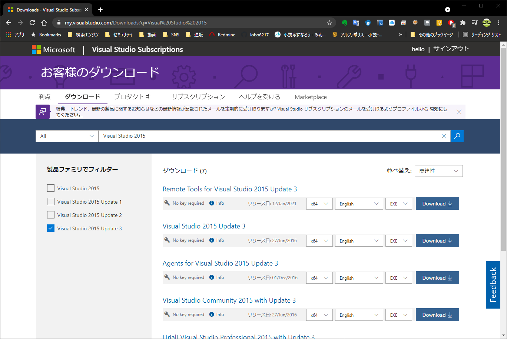
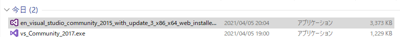
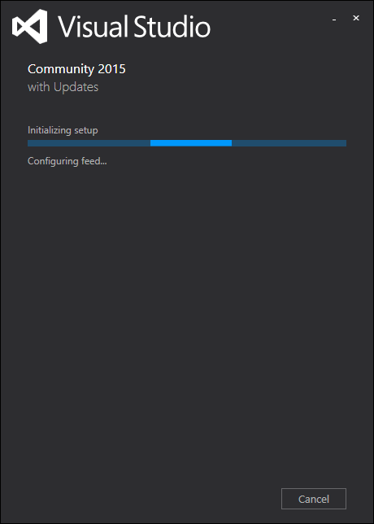
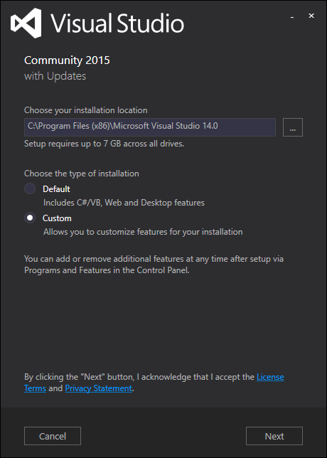
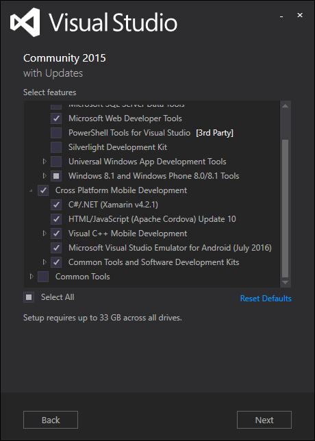
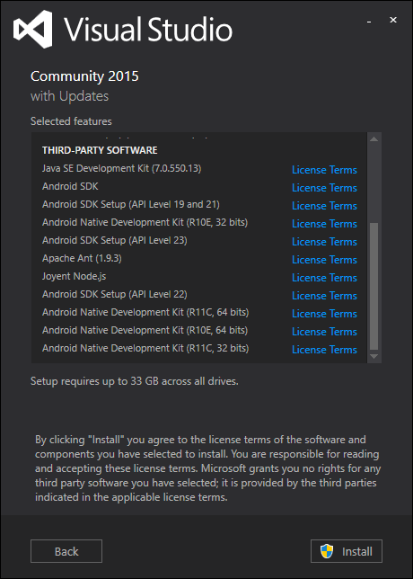
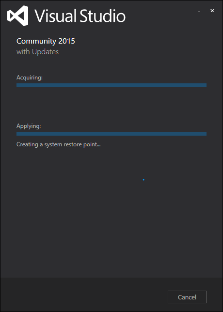

# # Xamarinで開発をするために、Visual Studio Community 2015 with Update 3 をインストールする
## ダウンロード Update3

## ダウンロードしたファイルを実行

## インストーラーの起動

## Customを選択

## Cross Platform Mobile Development にチェックを入れる

## install を押下

## インストール中
※ 30分以上かかる

HDの容量が足りなくなってきたので一旦Cancelした
