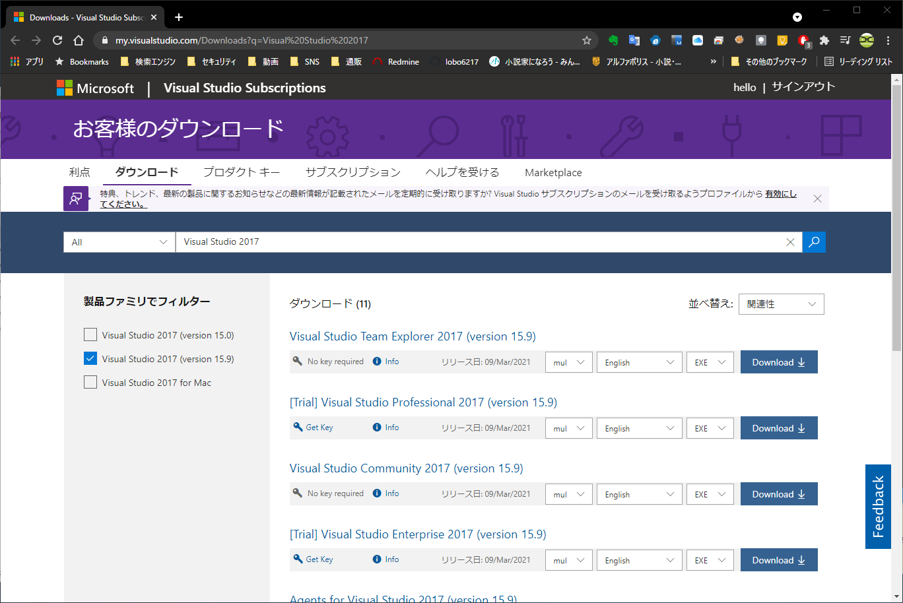
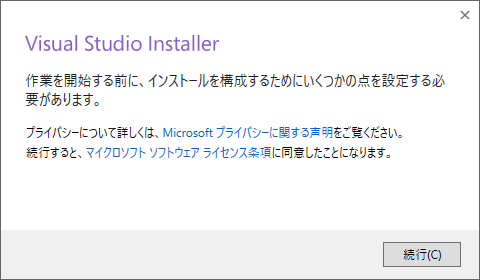
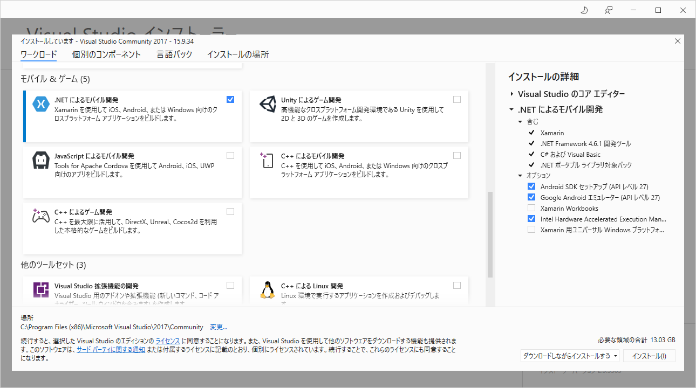
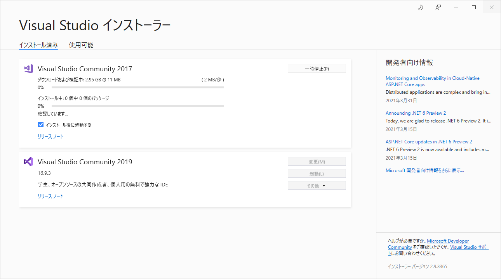
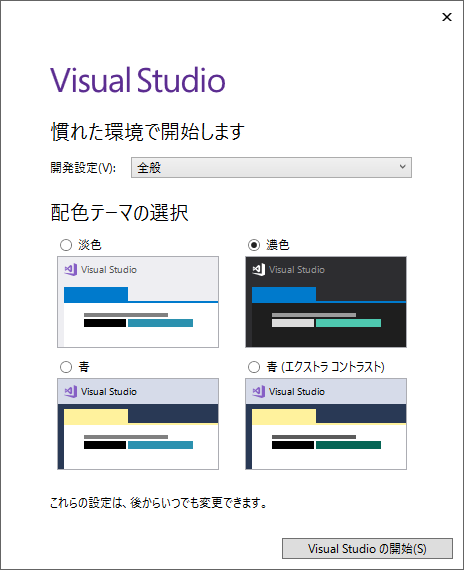
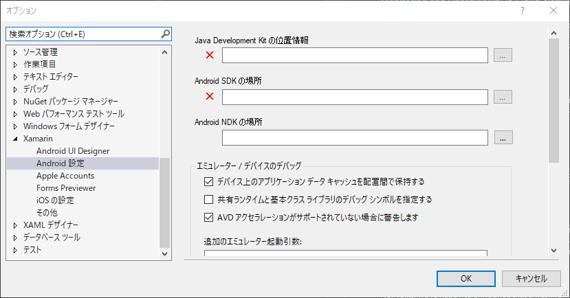
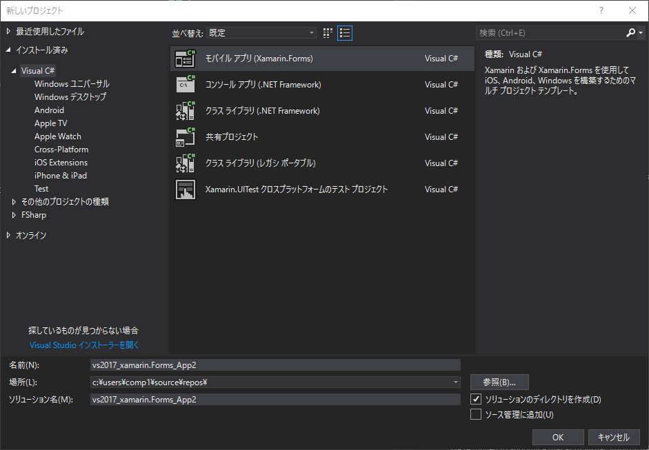
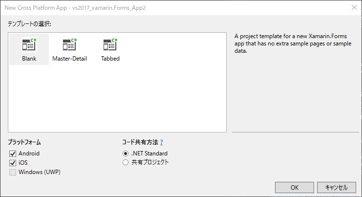
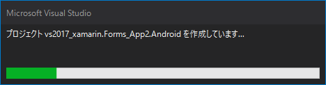

# Xamarinで開発をするために、Visual Studio 2017 をインストールする

## Microsoftにアクセス
https://my.visualstudio.com/Downloads?q=Visual%20Studio%202017  
※ サンインが必要なため、確認が必要

## Visual Studio Community 2017 (version 15.9) を押下してダウンロードする

## ダウンロードしたファイルを実行する

## Installerを続行する

## .NETによるモバイル開発を選択し、インストールを押下する

## Visual Studio インストーラー

## サンイン(後で行うを選択)

## 環境設定

## 準備

## スタートページ

## ツール > オプション > Xamarin > Android設定

## ファイル > 新規作成 > プロジェクト
※絶対パスが長くなるとビルドできなくなるので注意  
下記はエラーになるのでNG

## テンプレートの選択

## 作成

## >Android_Accelerated_x86_Oreo

## ビルド中

## 起動
