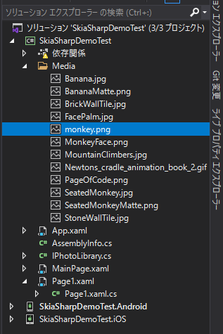
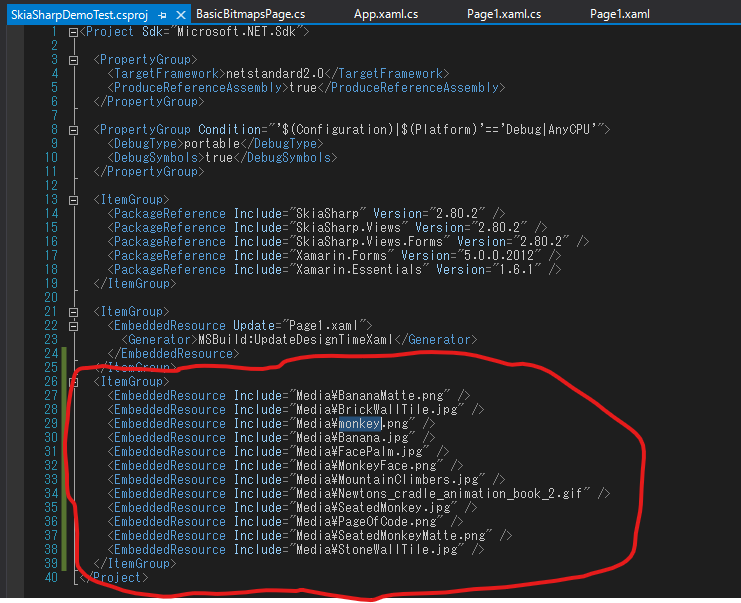
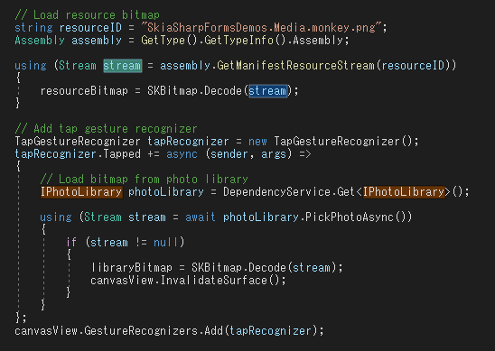
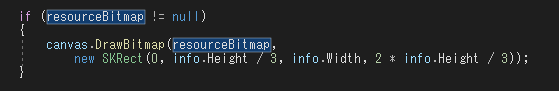
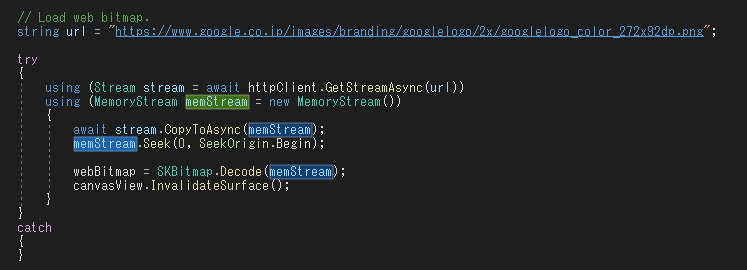
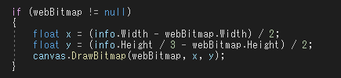
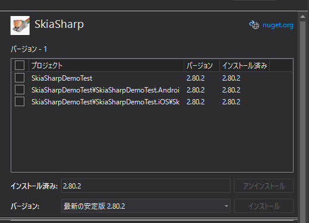

# Skia Sharpのデモを実行してみた(VisualStudio2019ならできる)

## ローカルファイルを表示する

- 画像ファイルをフォルダごと取り込む  

- csproj ファイルにItemGroupとしてリソースIDを追加する  
- VisualStudio2017ではcsprojファイルが存在しないため、リソースIDの記述する箇所がわからない  

- Assembly で リソースIDのファイルを読み込み、SKBitmapにDecodeする  
- VisualStudio2017ではリソースIDの記述方法がわからず、Assemblyで取得できないので、streamがNULLになる  

- SKBitmapが作成できていたら、DrawBitmapで画面に表示する  
- VisualStudio2017ではstreamがNULLなので、画像が表示されない  

## ネットから取得する

- urlを指定してHttpClientを使ってStreamを開き、MemoryStreamに取得する  
- 取得したMemoryStreamをSKBitmapにDecodeする  
- VisualStudio2017ではHttpClientが読み込めない。ネットが重いせいか、古いせいかは不明  
- HttpClientが読み込めないのでstreamが開けずこちらも画像が読み込めない 

- DecodeしたSKBitmapをDrawBitmapで表示する  

## 結果

## バージョン問題
- そもそもバージョンが違うのだから、コンパイル後の速度も違うのでは？  

