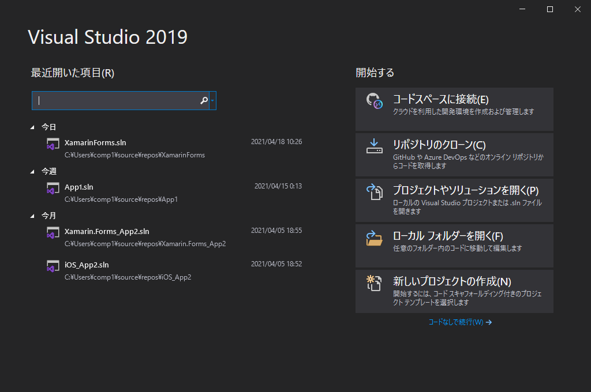
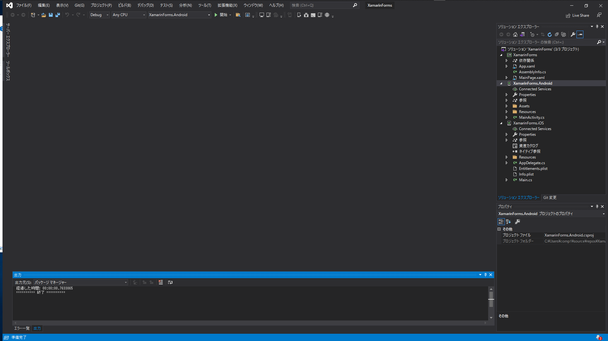
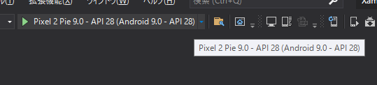
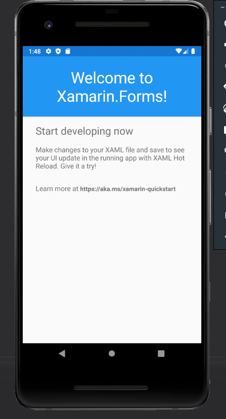
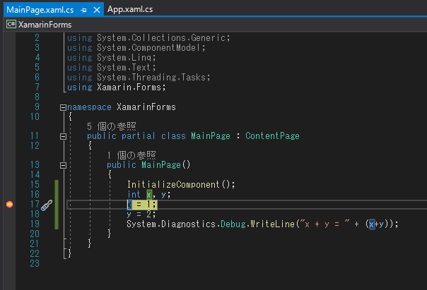
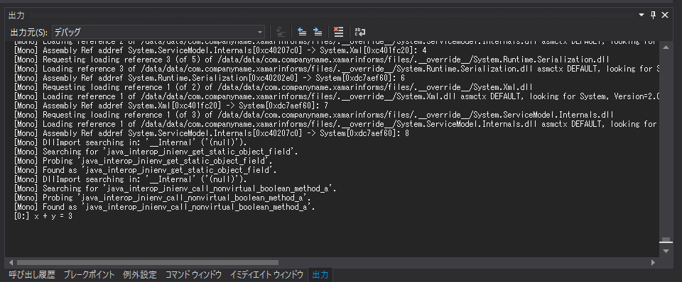
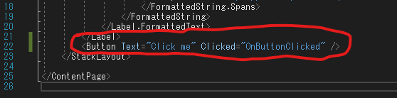
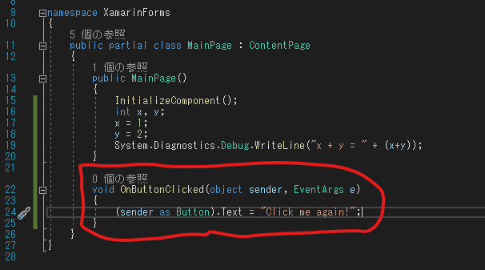
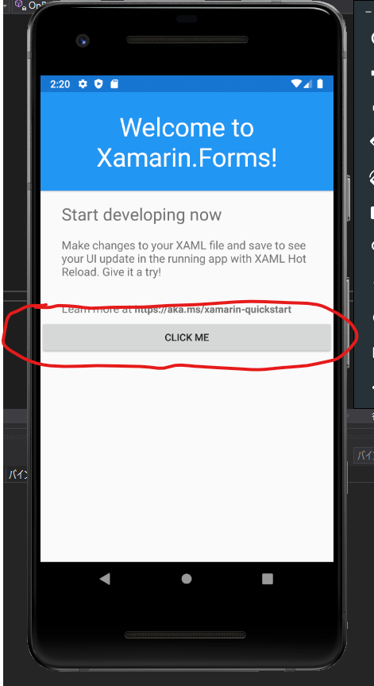
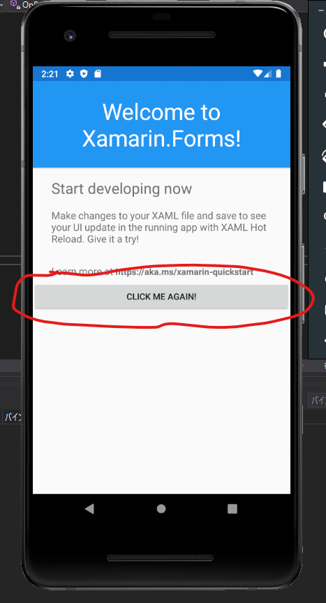

# Visual Studio 2019 でXamarinFormsのアプリを作成する

## 目次
- [とりあえず起動](#とりあえず起動)
- [画面にボタンを追加する](#画面にボタンを追加する)
- [ソケット通信](#ソケット通信)
    - [テキストメッセージ送受信](#テキストメッセージ送受信)
    - [画像受信](#画像受信)
- [画像表示](#画像表示)
- [画像変更](#画像変更)

## とりあえず起動

- 起動画面で新しいプロジェクトの作成を選択する


- 作成したらこんな感じで画面が開く


- 何も考えずに実行する


- 起動するとこんな感じの画面になる


- デバッグについて
    - 普通にブレークポイント仕掛けて実行すれば、デバッグが可能
    
    - ステップイン F11
    - ステップオーバー F10
    - ステップアウト Shift + F11
    - コンソール出力
        ```C#
        System.Diagnostics.Debug.WriteLine("x + y = " + (x+y));
        ```
    

- 初期表示時のMainPage.xaml
- テキストの背景の色の設定やテキストの文字色、テキストサイズ、ペディングなどの設定を行っている
    ```C#
    <?xml version="1.0" encoding="utf-8" ?>
    <ContentPage xmlns="http://xamarin.com/schemas/2014/forms"
                xmlns:x="http://schemas.microsoft.com/winfx/2009/xaml"
                x:Class="XamarinForms.MainPage">

        <StackLayout>
            <Frame BackgroundColor="#2196F3" Padding="24" CornerRadius="0">
                <Label Text="Welcome to Xamarin.Forms!" HorizontalTextAlignment="Center" TextColor="White" FontSize="36"/>
            </Frame>
            <Label Text="Start developing now" FontSize="Title" Padding="30,10,30,10"/>
            <Label Text="Make changes to your XAML file and save to see your UI update in the running app with XAML Hot Reload. Give it a try!" FontSize="16" Padding="30,0,30,0"/>
            <Label FontSize="16" Padding="30,24,30,0">
                <Label.FormattedText>
                    <FormattedString>
                        <FormattedString.Spans>
                            <Span Text="Learn more at "/>
                            <Span Text="https://aka.ms/xamarin-quickstart" FontAttributes="Bold"/>
                        </FormattedString.Spans>
                    </FormattedString>
                </Label.FormattedText>
            </Label>
        </StackLayout>

    </ContentPage>
    ```
## 画面にボタンを追加する
※右記URLを参照：https://docs.microsoft.com/ja-jp/xamarin/get-started/tutorials/button/?tabs=vswin&tutorial-step=1

1. MainPage.xamlにButtonタグを追加する


2. MainPage.xaml.csにボタンクリック時の処理を記述する


3. アプリを起動するとボタンが追加されていることがわかる


4. ボタンをクリックすると、記述した処理の通りボタンのテキストが変更されたことがわかる


## ソケット通信

### テキストメッセージ送受信

#### client

```C#
private void SendMsg(string msg)
{
    System.Net.Sockets.TcpClient tcp = new System.Net.Sockets.TcpClient(IpAddress, Port);
    print("サーバー({0}:{1})と接続しました({2}:{3})",
        ((System.Net.IPEndPoint)tcp.Client.RemoteEndPoint).Address,
        ((System.Net.IPEndPoint)tcp.Client.RemoteEndPoint).Port,
        ((System.Net.IPEndPoint)tcp.Client.LocalEndPoint).Address,
        ((System.Net.IPEndPoint)tcp.Client.LocalEndPoint).Port);

    // Streamを取得する
    System.Net.Sockets.NetworkStream ns = tcp.GetStream();

    // タイムアウトを設定する
    ns.ReadTimeout = 10000;
    ns.WriteTimeout = 10000;

    // エンコードを指定する
    System.Text.Encoding enc = System.Text.Encoding.UTF8;

    // 送信する文字列をbyte配列に変換する
    byte[] sendBytes = enc.GetBytes(msg + '\n');

    // 文字列をサーバーに送信する
    ns.Write(sendBytes, 0, sendBytes.Length);

    // サーバーから文字列を取得する
    System.IO.MemoryStream ms = new System.IO.MemoryStream();
    byte[] resBytes = new byte[256];
    int resSize = 0;

    do
    {
        resSize = ns.Read(resBytes, 0, resBytes.Length);
        if (resSize == 0)
        {
            print("サーバーが切断されました");
            break;
        }

        ms.Write(resBytes, 0, resSize);

    } while (ns.DataAvailable || resBytes[resSize - 1] != '\n');

    // サーバーから受け取ったByte文字列を文字列に変換する
    string resMsg = enc.GetString(ms.GetBuffer(), 0, (int)ms.Length);

    // Streamを切断する
    ms.Close();

    // サーバーから受け取った文字列を表示する
    resMsg = resMsg.TrimEnd('\n');
    print(resMsg);

    ns.Close();
    tcp.Close();
    print("切断しました");
}
private void print(string msg)
{
    System.Diagnostics.Debug.WriteLine(msg);
}
private void print(string format, params object[] args)
{
    System.Diagnostics.Debug.WriteLine(format, args);
}
```

#### server
```C#
private void server()
{
    string LocalIpAddress = "127.0.0.1";
    int Port = 8001;

    // サーバーを開始する
    System.Net.IPAddress IpAddress = System.Net.IPAddress.Parse(LocalIpAddress);
    System.Net.Sockets.TcpListener Listener = new System.Net.Sockets.TcpListener(IpAddress, Port);
    Listener.Start();

    print("Listenを開始しました({0}:{1})", ((System.Net.IPEndPoint)Listener.LocalEndpoint).Address, ((System.Net.IPEndPoint)Listener.LocalEndpoint).Port);

    // 受け入れ要求があった場合に、受け入れを開始する
    System.Net.Sockets.TcpClient Client = Listener.AcceptTcpClient();
    System.Net.IPEndPoint ClientIpEndPoint = (System.Net.IPEndPoint)Client.Client.RemoteEndPoint;
    print("クライアント({0}:{1})と接続しました", ClientIpEndPoint.Address, ClientIpEndPoint.Port);

    // Streamを取得する
    System.Net.Sockets.NetworkStream ns = Client.GetStream();
    ns.ReadTimeout = 100000;
    ns.WriteTimeout = 10000;

    // エンコード指定
    System.Text.Encoding enc = System.Text.Encoding.UTF8;
    bool disconnected = false;
    System.IO.MemoryStream ms = new System.IO.MemoryStream();

    byte[] resBytes = new byte[256];
    int resSize = 0;

    do
    {
        // データの一部を受信する
        resSize = ns.Read(resBytes, 0, resBytes.Length);

        // Readが0を返したときはクライアントが切断したと判断
        if(resSize == 0)
        {
            disconnected = true;
            print("クライアントが切断しました");
            break;
        }
        // 受信したデータをメモリに蓄積する
        ms.Write(resBytes, 0, resSize);

        // まだ読み取れるデータがあるか、データの最後が\n出ないときは、受信を続ける
    } while (ns.DataAvailable || resBytes[resSize - 1] != '\n');

    // メモリに蓄積したデータを文字列に変換
    string resMsg = enc.GetString(ms.GetBuffer(), 0, (int)ms.Length);
    ms.Close();

    // クライアントからまだ切断されていない場合は、メッセージを送る
    if (!disconnected)
    {
        string sendMsg = resMsg.Length.ToString();

        // 文字列をByte型配列に変換
        byte[] sendBytes = enc.GetBytes(sendMsg + "\n");

        // データを送信する
        ns.Write(sendBytes, 0, sendBytes.Length);
        print("send msg is [{0}]", sendMsg);
    }

    // 切断する
    ns.Close();
    Client.Close();
    print("クライアントから切断しました。");

    Listener.Stop();
    print("Listenerを閉じました。");

}
```
### 画像受信


## 画像表示

## 画像変更

