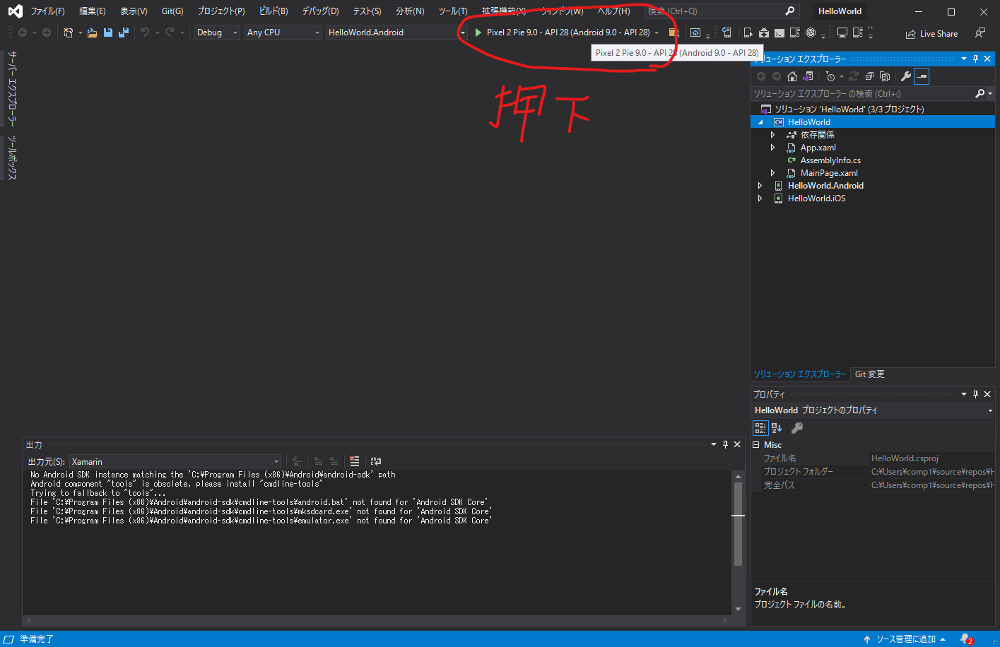

# Hello World
- Xamarin.formsでHello Worldの作成の仕方

## 0. 「.NETによるモバイル開発」のインストール
- Xamarin.formsで開発を行うためには、VisualStudio2019で「.NETによるモバイル開発」をインストールしておく必要がある。
- まだインストールしていない場合は、VisualStudioのインストーラーを起動してインストールを行う。

## 1. VisualStudio2019を起動する
- VisualStudioを起動さいたら、「新しいプロジェクトの作成」を押下する。

## 2. 検索に「Xamarin」を入力し、候補から「モバイルアプリ（Xamarin.Forms)」を選択する
- 「モバイルアプリ（Xamarin.Forms）」を選択したら「次へ（N）」を押下する

## 3. プロジェクト名「HelloWorld」を入力する
- プロジェクト名を入力したら、作成ボタンを押下する

## 4. アプリのテンプレートを選択で「空白」を選択する
- アプリのテンプレートを選択したら作成を押下する

## 5. プロジェクトが作成されるのを待つ
- ダイアログが出るので待つ

## 6. 作成が完了すると、VisualStudio2019が開く
- 起動に必要なファイルなどはすべてVisualStudio2019が作成してくれる

- 作成したフォルダを確認すると、必要なファイルが一式揃っている

## 7. コンパイルするためにAndroid SDKマネージャーを開いて、必要なSKDのバージョンをインストールする
- Android SDKマネージャーのバージョンにチェックを入れたら、変更の適用を押下すると、SDKがインストールされる

## 8. Androidデバイスマネージャーを開いて、AVDをインストールする
- Androidデバイスマネージャーを開いたら、新規を押下する

## 9. 基本デバイスとプロセッサとOSを選択する
- 選択したら作成を押下する

## 10. ダウンロードが始まるので、待つ
- しばらく時間がかかるため、ネット回線の遅い環境だとだいぶここで時間を取られる

## 11. ダウンロードが完了したら、開始を謳歌する
- 一覧に先程のデバイスが追加されているので、開始を押下する

## 12. VMが起動する
- 画像は他のVM

## 13. 起動したVMを選択して緑の▷を押下する

## 14. デバッグモードで起動することを確認する
