# Native Dialog
- Xamarin.FormsからAndroidにアクセスしてNativeのダイアログを表示する方法。
- Xamarin.Formsでは入力項目のあるダイアログは表示することが出来ない。
- 本来は入力項目があるのであれば別画面にしたほうがスマホ/タブレットアプリとしては自然だが、どうしてもダイアログにしたい場合がある。
- そういった場合に、Nativeにアクセスして画面に表示する方法を示す。

## 1. まずはからのXamarin.Formsプロジェクトを作成する
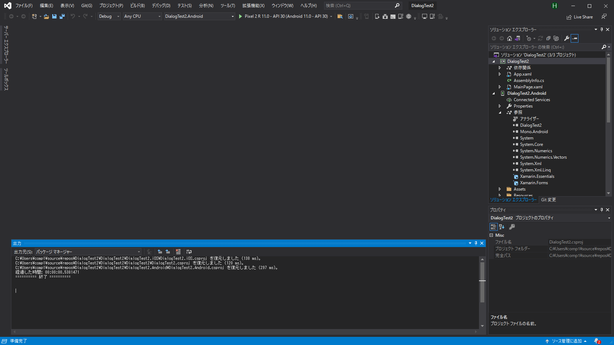

## 2. プロジェクトにインターフェースを追加する
- プロジェクトを右クリックして、[追加]->[新しい項目]を選択する。
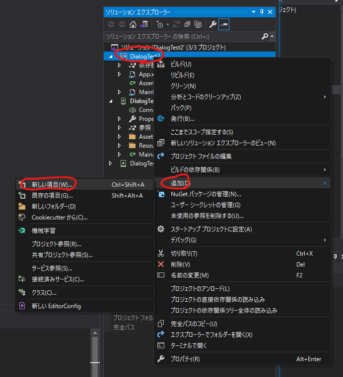

- [コード]->[インターフェース]を選択して、[名前]を入力し[追加]を押下する。
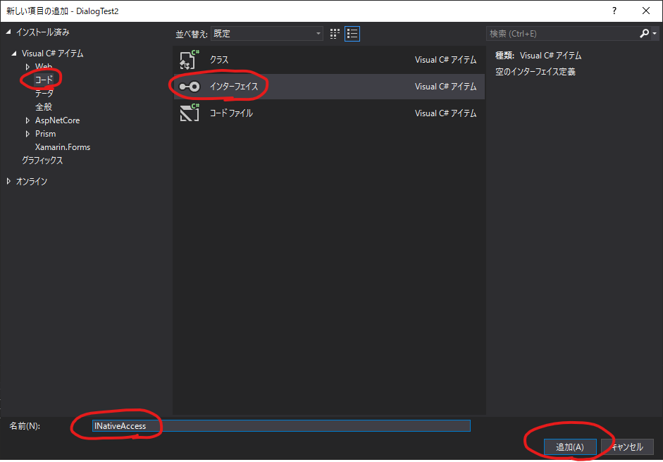

## 3. プロジェクトにインターフェースが追加され、コードが表示される
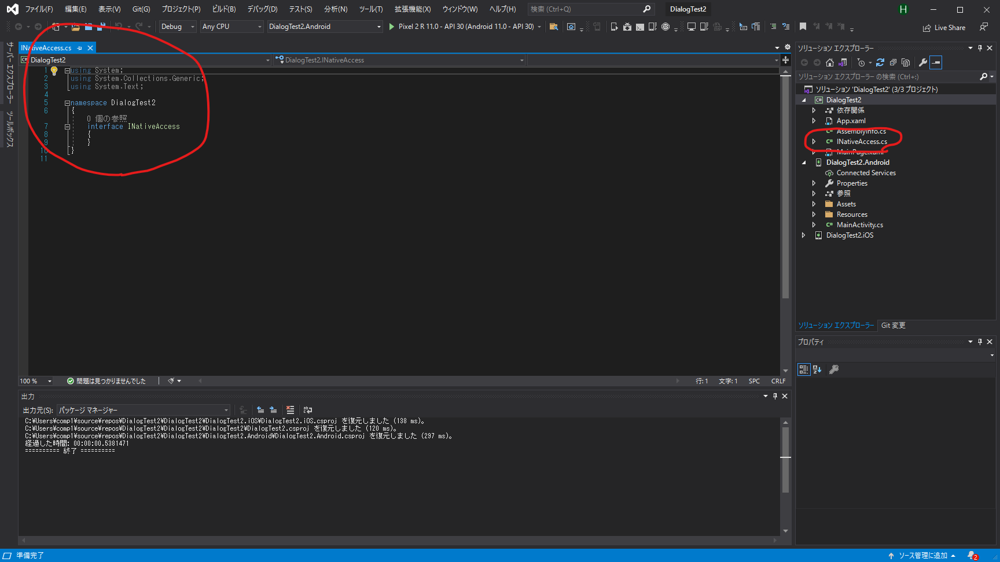

## 4. コードを追加する
- 追加前
```C#
using System.Threading.Tasks;

namespace DialogTest2
{
    interface INativeAccess
    {
    }
}
```

- 追加後  
※ インターフェースクラスはpublicにしておく
```C#
using System.Threading.Tasks;

namespace DialogTest2
{
    public interface INativeAccess
    {
        Task<ResultData> Show();
    }
    public class ResultData
    {
        string msg { get; set; }
    }
}
```
## 5. プロジェクト名.Androidを押下してインターフェースを実装するクラスを作成する
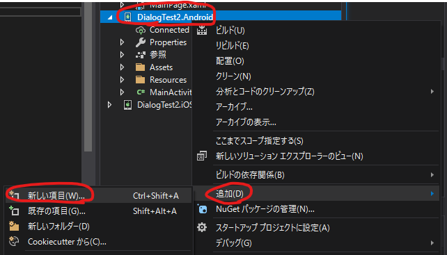

- [コード]を選択して[コードファイル]を選択し、[名前]にクラス名を入力して、[追加]ボタンを押下する。
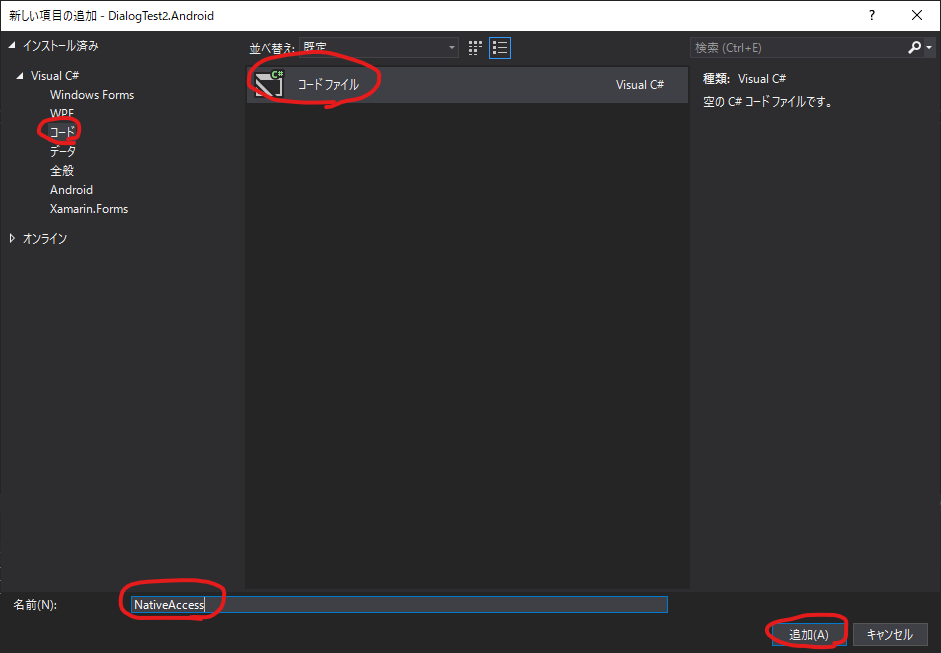

## 6. プロジェクト名.Androidに実装クラスが追加される
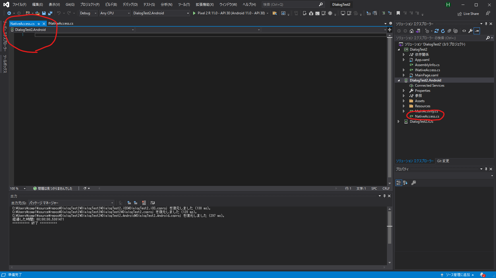

## 7. インターフェースを実装する
```C#
using Android.App;
using Android.Widget;
using System.Threading.Tasks;
using Xamarin.Forms;

[assembly: Dependency(typeof(DialogTest2.Droid.NativeAccess))]
namespace DialogTest2.Droid
{
    public class NativeAccess : INativeAccess
    {
        public Task<ResultData> Show()
        {
            // AndroidのContextを取得する
            var AndroidContext = (global::Android.Content.Context)MainActivity.context;

            // 戻り値用のTaskを作成する
            var tcs = new TaskCompletionSource<ResultData>();

            // 入力項目用Editを作成する
            EditText editText = new EditText(AndroidContext);

            // ダイアログを作成する
            AlertDialog dialog = new AlertDialog.Builder(AndroidContext)
                .SetTitle("Android版のダイアログ")
                .SetMessage("ダイアログメッセージ")
                .SetView(editText)
                .SetNeutralButton("Neutral", (o, e) => tcs.SetResult(new ResultData
                {
                    msg = string.Format("{0}が入力され、Neutralボタンが押下されました", editText.Text)
                }))
                .SetNegativeButton("Negative", (o, e) => tcs.SetResult(new ResultData
                 {
                    msg = string.Format("{0}が入力され、Negativeボタンが押下されました", editText.Text)
                }))
                .SetPositiveButton("Positive", (o, e) => tcs.SetResult(new ResultData
                {
                    msg = string.Format("{0}が入力され、Positiveボタンが押下されました", editText.Text)
                })).Create();

            // ダイアログを表示する
            dialog.Show();

            // 戻り値を返す
            return tcs.Task;
        }
    }
}
```

## 8. 画面レイアウト(プロジェクト名/MainPage.xml)を修正する
```xml
<?xml version="1.0" encoding="utf-8" ?>
<ContentPage xmlns="http://xamarin.com/schemas/2014/forms"
             xmlns:x="http://schemas.microsoft.com/winfx/2009/xaml"
             x:Class="DialogTest2.MainPage">

    <StackLayout>
        <Label x:Name="label"  Text="Hello World"/>
        <Button x:Name="button" Text="クリックしてみてください"/>
    </StackLayout>

</ContentPage>

```

## 9. MainPage.xml.csを修正する
```C#
using System;
using Xamarin.Forms;

namespace DialogTest2
{
    public partial class MainPage : ContentPage
    {
        public MainPage()
        {
            InitializeComponent();

            // ボタンに関数を設定する
            button.Clicked += ShowDialog;
        }
        private async void ShowDialog(object s, EventArgs e)
        {
            // ダイアログを非同期で生成する
            var result = await DependencyService.Get<INativeAccess>().Show();

            // 戻り値をlabelのTextに設定する
            label.Text = string.Format("{0}", result.msg);
        }
    }
}
```

## 10. 実行する

- ボタンをクリックする  
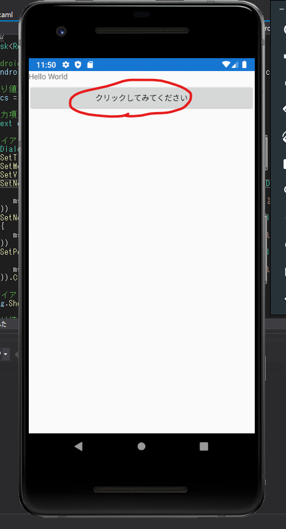  

- ダイアログが表示される  
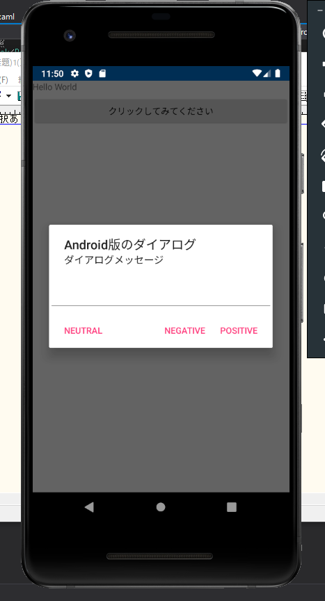  

- EditViewに適当に文字列を入力し、3つのボタンのうちどれでもいいから押下する  
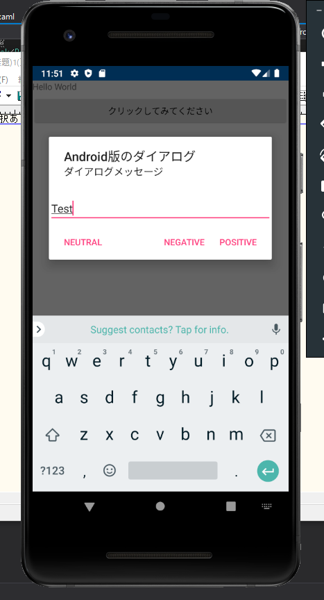  

- 元画面に値が戻ってくる  
    ※ ボタンはどれを押下してもダイアログは閉じられる  
    ※ ダイアログを閉じないようにするにはShowリスナーとOnClickリスナーを登録する必要がある  
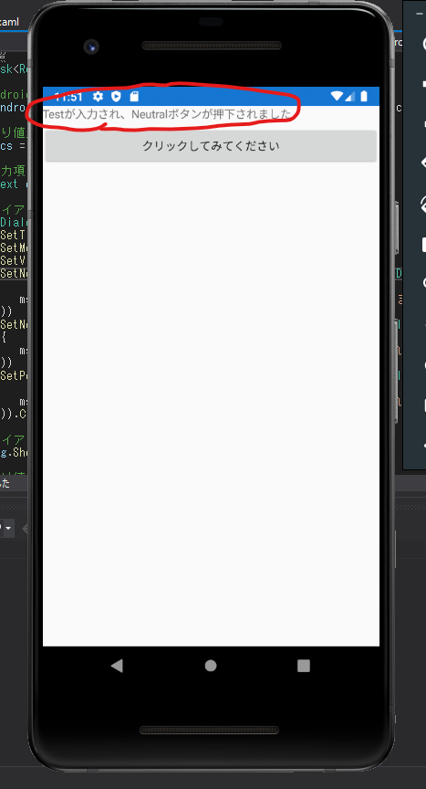